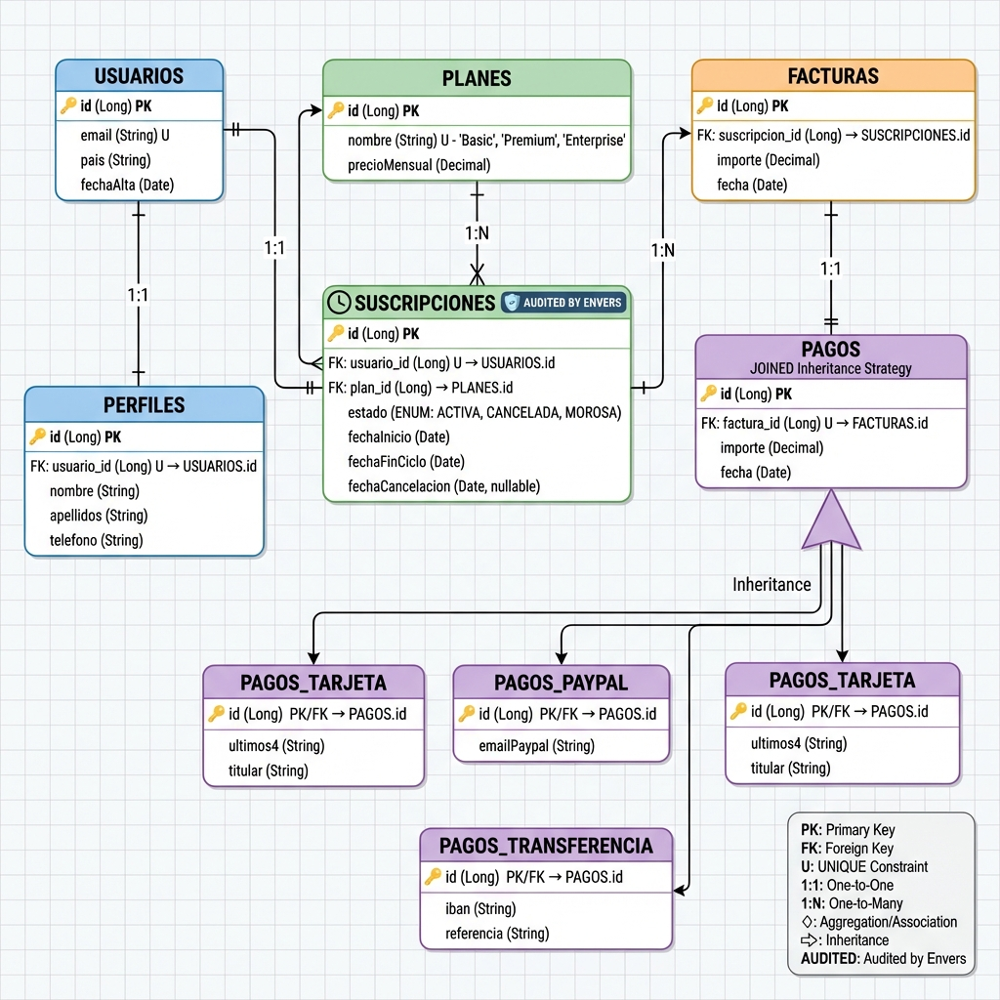

# ProyectoSpringBoot — Plataforma SaaS (Core)

Proyecto final desarrollado para la asignatura **Desarrollo de Interfaces**  
Grado Superior en Desarrollo de Aplicaciones Multiplataforma (2º DAM).

Implementación del **core de una plataforma SaaS**: registro de usuarios, suscripciones a planes, facturación automática cada 30 días, prorrateo en cambios de plan, cálculo de impuestos por país y auditoría de cambios.

---

## 🚀 Cómo ejecutar el proyecto

### 1. Levantar la base de datos (PostgreSQL con Docker)

```bash
docker compose up -d
```

La base de datos arranca en `localhost:5433`.

### 2. Arrancar la aplicación

Desde IntelliJ o con Maven:

```bash
mvn spring-boot:run
```

Hibernate crea/actualiza las tablas automáticamente (`ddl-auto=update`).

### 3. Acceder a la aplicación

Abrir el navegador en: **`http://localhost:8080`**

Desde la página de inicio se puede navegar al registro, login y resto de secciones.

---

## � Acceso de Administrador

El sistema tiene dos roles: **usuario normal** y **administrador**.

El administrador se crea automáticamente al arrancar la aplicación (`DataInitializer`):

| Campo | Valor |
|---|---|
| Email | `admin@saas.com` |
| Contraseña | `admin123` |

Al hacer login con estas credenciales, Spring Security redirige automáticamente al **Panel de Auditoría** (`/admin/auditoria`).

> El panel de auditoría muestra el historial completo de cambios en suscripciones gracias a **Hibernate Envers** (`@Audited`).

---

## 📌 Funcionalidades implementadas

### Semana 1 — Modelo de datos
- **Entidades**: `Usuario`, `Perfil`, `Suscripcion`, `Plan`, `Factura`, `PagoTarjeta`, `PagoPaypal`, `PagoTransferencia`
- **Enums**: `EstadoSuscripcion` (ACTIVA, CANCELADA, MOROSA, PENDIENTE_PAGO)
- **Herencia de tablas**: `JOINED` para los distintos tipos de pago
- **Auditoría con Envers**: `@Audited` en `Suscripcion` para registrar quién cambió de plan y cuándo
- **Diagrama E-R** incluido en el repositorio (`DIAGRAMA_ER.png`)

### Semana 2 — Lógica de negocio
- **Renovación automática**: Genera factura al renovar ciclo de 30 días
- **Pago Automático (Domiciliación)**: Scheduler nocturno que renueva y cobra automáticamente si el usuario lo activa.
- **Cancelación automática**: Si una suscripción vence y no se paga en 3 días, el sistema la cancela (Scheduler).
- **Cálculo de impuestos por país**: España 21%, Francia 20%, USA 10%, resto 0%
- **Prorrateo en cambio de plan**:
  - Upgrade (Basic → Premium): cobra la diferencia proporcional a los días restantes
  - Downgrade: aplica en la próxima renovación, sin cargo inmediato
- **Filtros de facturas**: por fecha de inicio, fecha fin, total mínimo y total máximo (JPA Specifications)
- **Simulación de método de pago**: Tarjeta, PayPal, Transferencia bancaria
- **Panel de Auditoría (Admin)**: historial de cambios con Envers

### Semana 3 — Pruebas, seguridad y pulido
- **Spring Security**: Login con roles (`ROLE_USER`, `ROLE_ADMIN`), CSRF, redirección por rol
- **Pruebas unitarias (JUnit + Mockito)**: cobertura de los casos críticos
- **Refactorización de vistas**: eliminación de estilos inline, CSS externo organizado
- **UX/UI**: vistas limpias y coherentes en todas las páginas

---

## ✅ Pruebas Unitarias (JUnit + Mockito)

### Ejecutar tests

```bash
mvn test
```

O desde IntelliJ: click derecho en `src/test/java` → *Run 'All Tests'*

### Casos cubiertos

| # | Caso de prueba | Resultado esperado |
|---|---|---|
| 1 | Impuesto España (ES) | 21% aplicado correctamente |
| 2 | Impuesto país no configurado | 0% (sin impuesto) |
| 3 | Renovación cuando ha vencido | Genera factura y avanza ciclo |
| 4 | Renovación cuando aún no toca | No genera factura, lanza aviso |
| 5 | Prorrateo upgrade (Basic → Premium) | Cobra diferencia proporcional a días restantes |
| 6 | Prorrateo downgrade (Premium → Basic) | No cobra nada, aplica en próxima renovación |
| 7 | Facturación masiva (batch) | Genera N facturas para N suscripciones vencidas |

---

## 📸 Capturas de pantalla

| Home | Iniciar Sesión |
| :---: | :---: |
|  |  |

| Dashboard | Mis Facturas |
| :---: | :---: |
|  |  |

| Registro | Panel Admin (Auditoría) |
| :---: | :---: |
|  |  |

---

## � Estructura del proyecto

```
src/
├── main/
│   ├── java/.../
│   │   ├── config/          # DataInitializer, SecurityConfig
│   │   ├── domain/
│   │   │   ├── entity/      # Usuario, Perfil, Suscripcion, Plan, Factura, Pago*
│   │   │   └── enums/       # EstadoSuscripcion
│   │   ├── repository/      # JPA Repositories
│   │   ├── service/         # FacturaService, SuscripcionService, AuditoriaService
│   │   └── web/controller/  # DashboardController, FacturaController, AdminController
│   └── resources/
│       ├── templates/       # Vistas Thymeleaf
│       └── static/css/      # base.css, dashboard.css, auditoria.css
└── test/                    # Tests JUnit + Mockito
```

---

## 📊 Diagrama E-R



---

## 💡 Decisiones de diseño relevantes

**Modelo de Suscripción (Prepago vs Postpago)**:
El sistema utiliza un modelo de **prepago** (el usuario paga por adelantado el mes que va a disfrutar).
- Si un usuario no renueva a tiempo, **no genera deuda** (no es "moroso"), simplemente pierde el acceso al servicio del mes siguiente.
- Por ello, el estado `MOROSA` (presente en el enum original) se ha sustituido funcionalmente por la **cancelación automática** tras 3 días de gracia sin pago.
- El estado `CANCELADA` refleja mejor la realidad del negocio: el usuario decidió no continuar (o no pagar) y el servicio se detiene.

---

## ✍️ Notas

Proyecto académico desarrollado de forma incremental en 3 semanas.  
Prioriza claridad del modelo, coherencia con los requisitos y código defendible.
