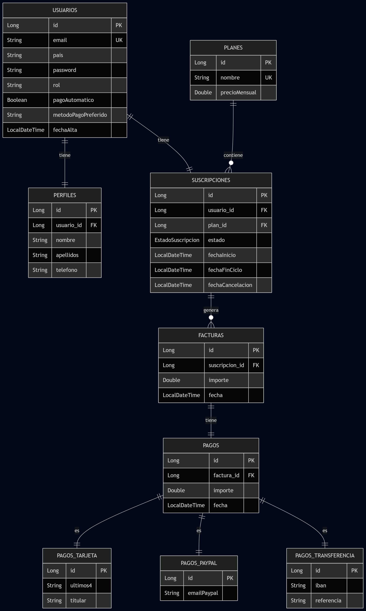

# 📘 Documentación del Proyecto SaaS

## 1. Descripción del Proyecto

Este proyecto consiste en el desarrollo del **Core de una Plataforma SaaS** (Software as a Service). El sistema permite gestionar el ciclo de vida completo de suscripciones de usuarios, incluyendo registro, selección de planes, facturación recurrente automática y gestión de pagos.

El objetivo principal es proporcionar una arquitectura backend robusta, escalable y auditada, capaz de manejar cambios en el modelo de negocio (como actualizaciones de planes) y garantizar la integridad de los datos financieros.

---

## 2. Tecnologías Utilizadas

*   **Lenguaje:** Java 17+
*   **Framework Principal:** Spring Boot 3.x
*   **Persistencia:** Spring Data JPA (Hibernate)
*   **Base de Datos:** PostgreSQL / H2 (Desarrollo)
*   **Seguridad:** Spring Security (BCrypt, CSRF protection)
*   **Motor de Plantillas:** Thymeleaf
*   **Auditoría:** Hibernate Envers
*   **Automatización:** Spring Scheduling (`@Scheduled`)
*   **Contenerización:** Docker & Docker Compose

---

## 3. Requisitos Funcionales

El sistema cumple con los siguientes requisitos divididos por fases de desarrollo:

### ✅ Semana 1: Modelo de Datos Robusto
*   **Gestión de Usuarios:** Registro con email único, contraseña encriptada y configuración regional (país).
*   **Perfiles de Usuario:** Información personal extendida vinculada 1:1.
*   **Planes de Suscripción:** Catálogo flexible (Basic, Premium, Enterprise).
*   **Suscripciones:** Gestión del estado (ACTIVA, CANCELADA, MOROSA).
*   **Historial de Cambios (Auditoría):** Registro automático de todas las modificaciones en suscripciones usando **Hibernate Envers** (`@Audited`).
*   **Herencia de Pagos:** Soporte polimórfico para Tarjeta, PayPal y Transferencias.

### ✅ Semana 2: Lógica de Negocio y Facturación
*   **Renovación Automática:** Proceso en segundo plano (Scheduler) que detecta suscripciones vencidas y genera nuevas facturas.
*   **Cálculo de Impuestos:** Lógica dinámica basada en el país del usuario.
*   **Gestión de Ciclo de Vida:**
    *   Control de fechas de fin de ciclo.
    *   Bloqueo de servicios en caso de impago.
*   **Filtrado de Facturas:** Búsqueda avanzada por fecha y rango de importes (JPA Specifications).
*   **Vistas Funcionales:** Paneles de administración para visualizar facturación global y auditoría de cambios.

### ✅ Semana 3: Pruebas, Interfaz y Documentación
*   **Interfaz de Usuario (UX/UI):**
    *   Dashboard responsive y moderno.
    *   Formularios de pago dinámicos.
    *   Visualización clara de estado de suscripción y facturas con etiquetas de color.
*   **Cambio de Plan:** Lógica para permitir upgrade/downgrade.
*   **Pruebas Unitarias:** Cobertura de casos críticos con JUnit.
*   **Exportación de Datos:** Diagrama ER normalizado y documentación técnica.

---

## 4. Requisitos No Funcionales

*   **Seguridad:** Todas las contraseñas se almacenan cifradas. Protección contra ataques comunes web.
*   **Escalabilidad:** Diseño modular (Controller-Service-Repository).
*   **Auditabilidad:** Trazabilidad completa de cambios sensibles.
*   **Mantenibilidad:** Código limpio y separación de responsabilidades.
*   **Resiliencia:** Manejo de transacciones (`@Transactional`) para consistencia.

---

## 5. Modelo de Datos (E-R)

El sistema se basa en un modelo relacional normalizado.



### Entidades Principales
1.  **USUARIOS:** Credenciales y configuración regional.
2.  **PERFILES:** Datos personales.
3.  **PLANES:** Definición de productos y precios.
4.  **SUSCRIPCIONES:** Nexo central que une Usuario y Plan.
5.  **FACTURAS:** Documentos fiscales generados periódicamente.
6.  **PAGOS:** Registro de transacciones monetarias (con herencia).

---

## 6. Guía de Ejecución

Para iniciar el proyecto completo:

```bash
docker-compose up --build
```
